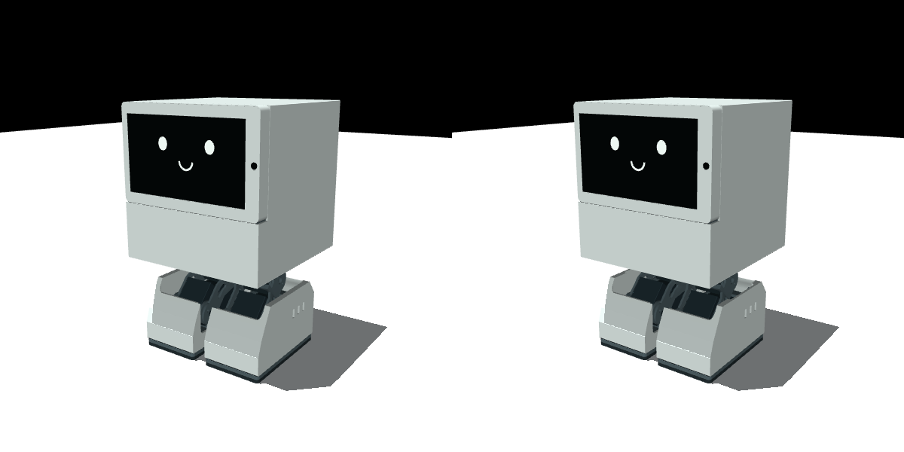

# 外形を保った脚内部クリアランス修正

電池込み・股間隔44 mm候補に、クレードル・足首ジンバル・足外装上端の局所修正を加える。
脚長、関節位置、モーター、電池、足底は変えない。製作リリースではない。



## 形状変更

- クレードル下端: 基底座標の中心X=−11 mm、Z=14.5 mmに7×28×5 mmの切欠き。
  モーター軸と上側の支持部は維持する。ねじ配置と局所強度は別途検証が必要。
- 足首ジンバル: 斜め腕の輪郭の2頂点を4 mm下げ、膝モーター下面を避ける。
  軸孔、板厚、後端の接続部を維持する。左右とも単一ソリッドであることをSTEP再読込みで確認。
- 足外装: 上端内側の中心(1,0,38) mmに42×56×8 mm・角R2 mmの逃げ。
  脛との接触があった内側の縁を削る。外側面・足底の寸法は維持する。
- 胴体開口: 以前の49姿勢の開口を基に、同じログの全446保存姿勢から再生成。
  1.5 mmの設計余裕を適用する。物理計算の全1 msサブステップや連続掃引を含むものではない。

質量は約855.326 g。元の電池込み候補約858.567 gから約3.241 g減少。
変更STLは胴体・左右クレードル・左右ジンバル・左右足外装の7部品のみ。他31部品はバイト単位で一致。
関節位置・軸・可動範囲は不変、MuJoCoモデルは17 qpos・16速度・10アクチュエータでコンパイルする。
公称姿勢の外接寸法は128×128×212.582 mmで変わらない。

## 検証範囲

`validation/leg_relief/` に機械部品33個の全組合せの検査結果を保存する。
高速74・中速137・低速235の計446保存姿勢で、体積重なり0.01 mm³を超える干渉はなかった。
判定閾値は体積重なり0.01 mm³。CAD検査に同一リンクや親子リンクの除外はない。

`before_dense_opening/` は開口の再生成と足上端修正をする前の全保存姿勢検査。
10行おきでは見えなかった胴体／脚と足外装／脛の干渉が記録されている。
この結果を受け、開口生成と確認のサンプリングを1行おきへ変更した。
これはサンプリング間の安全を保証する手法ではない。

変更後の自由基底動力学試験では、0.10 m/s参照・0.3秒周期で1.479秒、約23.664 mm前進した時点で
左股ロール／左膝モーターの接触により終了した。有効着地は0回で、歩行目標は未達。
停止時の実CADも距離0 mm、重なり約0.000211 mm³であり、上記スクリーニング閾値より小さい。
**CADの閾値判定に合格しても、接触ゼロや必要な実機隙間を意味しない。**
接触停止を無効化せず、モーター間の最低距離を確保する関節の組合せと歩容を次に検討する。

材料・板厚による剛性、ねじ締結、配線、製造公差、衝突代理形状の妥当性、実機歩行は未検証。
特にジンバルの腕の変更は、単一ソリッドであることだけでは荷重経路の強度を証明できない。

## 再現

`design/README_ja.md` と `design/gait_opening/README_ja.md` の環境・元候補生成を先に実施する。
以下の出力先は存在しないこと。

```bash
.venv-cad/bin/python derive_underside_cutouts.py \
  --design outputs/design_r6_gait_opening \
  --trajectory validation/reference_gait/fast_crouched/trajectory.csv \
  --trajectory validation/reference_gait/medium_crouched/trajectory.csv \
  --trajectory validation/reference_gait/slow_comp/trajectory.csv \
  --stride 1 --margin-mm 1.5 --out outputs/underside_gait_dense
.venv-cad/bin/python build_design.py \
  --out outputs/design_r6_leg_collar_relief --hip-half-spacing-mm 22 \
  --battery-layout design/battery_layouts/internal_lower_envelope.json \
  --underside-cutouts design/leg_relief/underside_cutouts.json \
  --leg-clearance-relief --boot-collar-relief
.venv-dynamics/bin/python validation/verify_opening_variant.py \
  --baseline outputs/design_r6_battery_lower \
  --candidate outputs/design_r6_leg_collar_relief --leg-relief --boot-relief \
  --out outputs/leg_collar_invariants.json
```

CAD検査を `fast_crouched`、`medium_crouched`、`slow_comp` の各ログに適用する。

```bash
.venv-cad/bin/python check_design_clearance.py \
  --design outputs/design_r6_leg_collar_relief \
  --trajectory-csv validation/reference_gait/fast_crouched/trajectory.csv \
  --stride 1 --out outputs/leg_collar_fast_crouched_full.json
.venv-dynamics/bin/python probe_reference_gait.py \
  --design outputs/design_r6_leg_collar_relief \
  --speed .1 --step-period .3 --height-offset-mm -5 \
  --static-compensation --slew 6 --out outputs/leg_collar_fast_dynamics
.venv-cad/bin/python inspect_design_pair.py \
  --design outputs/design_r6_leg_collar_relief \
  --trajectory-csv validation/leg_relief/dynamics_fast/trajectory.csv \
  --parts left_hip_roll_motor left_knee_motor --out outputs/motor_contact.json
MUJOCO_GL=egl .venv-dynamics/bin/python validation/render_design_comparison.py \
  --baseline outputs/design_r6_battery_lower \
  --candidate outputs/design_r6_leg_collar_relief --out outputs/comparison.png
```

`before_dense_opening/` の元候補は `--underside-cutouts design/gait_opening/underside_cutouts.json`
と `--leg-clearance-relief` のみで生成する。`--boot-collar-relief` は付けない。
