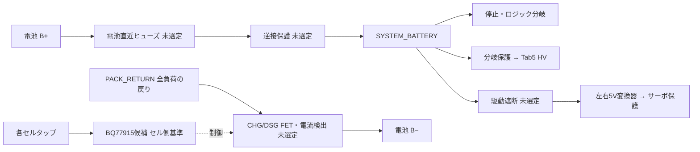

# セル保護とロボット電源の接続境界

## 判断

3S候補を継続する。ただしBQ7791500は単独UV保護として不採用へ変更した。
[CELL_PROTECTION_SCREEN_ja.md](CELL_PROTECTION_SCREEN_ja.md)参照。以下は低側遮断の比較案であり、置換ICに応じて見直す。セル保護の負極遮断より負荷側に、Tab5・停止制御・駆動の
全ての戻り線を置く。停止制御だけをセル側から常時給電する案は採らない。
停止制御を維持するのは**駆動のみの遮断時**であり、セル低電圧時の継続消費は許可しない。
これは接続方針の決定であり、保護回路の完成・製作許可ではない。

矢印は接続関係であり、FETの向きや双方向遮断を保証しない。
FET・検出抵抗の順序、ゲート保護、漏れ経路はTIの適用回路と実部品で確定する。
[TI BQ77915 Rev.L](https://www.ti.com/lit/ds/symlink/bq77915.pdf) の
図9-11（3S）、§10.1.1.2〜4（CHG/LD端子・ゲート・UV復帰）を設計根拠とする。
セル側基準と負荷側基準が遮断中にずれるため、GNDという名前だけで統合しない。

## 既存117部品候補との対応

機械可読の接続案は `schematics/power/battery_protection_boundary_candidate.json`。
既存候補自体は変更していない。

| 既存端子 | 上位回路で接続する先 | 意味 |
|---|---|---|
| BATTERY_RAW | SYSTEM_BATTERY | 「セル保護前」を意味しない。駆動遮断前・セル保護後の正極分岐 |
| GND | PACK_RETURN | 負荷側戻り。電池B−へ直接接続しない |
| DRIVE_BATTERY_PROTECTED | 駆動遮断後の同名ネット | 左右レギュレータVIN。停止回路の給電とは分ける |
| Tab5 HV/GND | 分岐保護後のSYSTEM_BATTERY / PACK_RETURN | サーボ5V出力から給電しない |

TPS26601内部のRTNとGNDは独自の保護機能に関係するため、この表を理由に短絡しない。
バランス端子のメーカー・並びは未確認。セルタップをロボットADCへ直接接続しない。
セル状態を制御系へ通知する場合の絶縁または電位差対応回路は別途設計する。

## 給電状態ごとの設計責務

| 状態 | 確定する接続方針 | 未確認の成立条件 |
|---|---|---|
| 電池のみ、駆動許可 | 全負荷の電池帰路はセル保護を通る | しきい値、熱、配線損失、ヒューズ協調 |
| 電池のみ、駆動遮断 | 停止制御・Tab5は給電可能、サーボは切離す | 駆動遮断の逆流、DATA給電、回生、残留電荷 |
| セル保護作動 | 全ロボット分岐の電池帰路を遮断 | 各FET状態のボディダイオード、漏れ、端子定格。完全双方向遮断とは未判定 |
| USBのみ | USB側のGNDもPACK_RETURN側 | Tab5からHV・通信・サーボへの逆給電を実回路で追跡 |
| 電池＋USB | USB接続だけではセル保護迂回と判定しない | 同じ外部機器からB−へ別接続がある場合の迂回、USB電源の逆流 |
| 電池・USBなし | 駆動許可は失効 | 残留電荷、再給電時の既定OFFと手動再始動 |
| 外部充電 | 主電源とセルタップをロボットから外す | 電池対応充電器、接続順、コネクタ誤接続防止 |

オシロスコープやデバッガの共通接地でもB−とPACK_RETURNを橋絡し得る。
セル保護の評価では絶縁計測または定格内の差動計測を設計し、接地クリップで短絡しない。
USBの有無だけで合否を決める試験にはしない。

## 次の具体的な終了条件

1. パックの最低セル電圧を一次仕様で確定し、検出下限・最長遅延・停止中消費から
   UV部品設定を選ぶ。パック合計電圧でセル最小電圧を代用しない。
2. 上図の未選定部品を選び、全CHG/DSG状態と外部給電についてピン単位で経路を追う。
   逆流を止める素子と残るダイオード経路を記録する。
3. 上位接続を117部品候補へ実装し、通常・停止・低電圧・復帰を回路評価する。
   この文書だけでは#21〜24の回路モデルや異常時評価を満たさない。

未選定部品と外部給電経路は設計残件として#21〜24に残す。
完成回路の実際の過渡・発熱・漏れだけを#49へ引き渡す。現時点の判断は製作HOLD。
