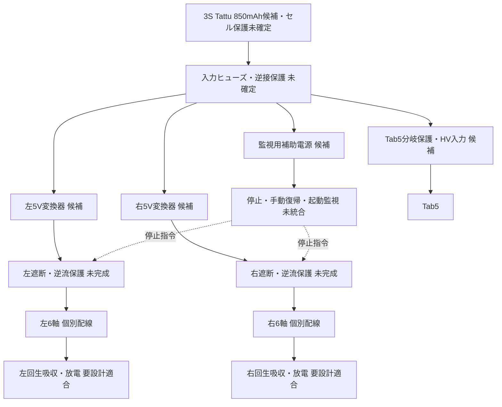

# 左右分離電源構成の採否資料

結論：左右別5Vは候補。電池・変換器・保護の確定構成ではなく、動力通電は保留。
Tab5顔配置・12軸と外形維持は要求。左右分離・個別枝配線は設計側の提案。

図は電力・制御の機能関係であり完成配線図ではない。左右出力V+を相互接続しない。
GND帰路は配電点へ集約する案。通信経由の逆給電・GND電位差の検証は残る。
同一3S電池からTab5のHV入力へ分岐する案を検討する。配線・保護は未確定。
電池は取り外して外部バランス充電する案で、Tab5の電池接点には接続しない。

| モード | 必要な振る舞い | 現状 |
|---|---|---|
| 起動・未許可 | 両駆動出力を抑止、監視を先に有効化 | revI局所回路のみ、統合未証明 |
| 新規手動許可 | 両レールを監視付きで起動、時間内に正常確認 | 起動監視本体・期限未確定 |
| 通常駆動 | 両レール端子電圧と配線・部品定格内で動作 | 条件付きDC包絡のみ |
| 減速・回生 | 各レールで過電圧と蓄積エネルギーを制限 | 既存単レール試算の全身適合は未確認 |
| 片側異常 | 両側の停止要求、各側の遮断と残留処理 | 検出・遮断・姿勢挙動の統合未証明 |
| 停止・電源復帰 | 自動再許可せず、新たな手動操作を要求 | 局所論理検査あり、全電源状態未証明 |
| 低残量・充電中 | 部品許容条件に従う | セル監視・充電器未確定、充電中の動作許可なし |

## 候補と予算

既製HOBBYWING 30603000の5V対応版×2を候補に追加した。
D42V55F5×2、TPSM63610RDFR×2の比較記録も保持する。
電池はTattu TA-45C-850-3S1P-XT30を候補とし、内蔵BMSを仮定しない。
旧2S向けの監視・補助回路はそのまま流用せず、3S入力で定格を再照合する。
候補の詳細と未確認事項は`RC_SUPPLY_ja.md`、機械可読データは
`schematics/power/rc_supply_candidate.json`を参照。最終購入BOMではない。
モデル内DC消費包絡は片脚4.917A、全軸9.834A。待機を含むが、実機内部損失・
PWM・突入・故障・Tab5・補助回路・変換器損失を含まない。
5Vで全軸49.17Wという換算もモデルの包絡であり、電池入力電力ではない。
総電池電力は各負荷と効率・損失が未確定のため数値化しない。

## 採用に必要な次の証跡

1. 電池/BMS、Tab5給電、充電時の仕様と、負荷時の最低入力電圧。
2. DC負荷・過渡条件と変換器の保証範囲、実効容量・配電・熱設計。
3. ヒューズ、逆接・逆流・過電流・低電圧・回生・停止の統合回路。
4. 同じ確定構成での通常・最悪・異常解析と判定。

未設計事項は#21〜#24に残す。完成回路の温度・実波形・実回生など実測事項のみ#49へ分離する。
親#6の最悪条件・異常時エネルギーの条件は、この機能図や接続表では達成しない。

証跡：`validation/model_dc_envelope_v2/`、`validation/precision_supply_screen_v1/`、
`schematics/power/precision_supply_adoption_gate.json`、
`schematics/power/split_servo_harness_revA/`、`validation/split_servo_harness_check_v1/`。
