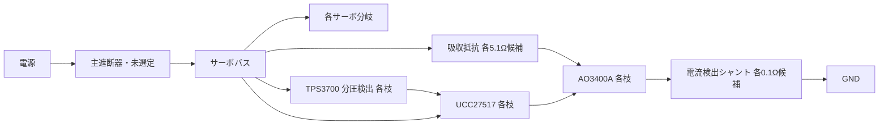

# 共通回生吸収回路 revA 接続候補（製造不可）

部品カードを2枝の接続表に統合した。`connections.csv`は回路図作成用の論理ネット表であり、配線指示や動作可能なSPICEモデルではない。ICは資料で確認したパッケージ番号、MOSはG/D/Sの論理端子で表し、MOSのパッド番号は未割当。値TBDの部品を仮の短絡で埋めない。

各枝の検出器とドライバは、主遮断器の**負荷側**から給電する。上流の停止信号を吸収停止指令と共用しない。電流検出の増幅器/故障判定/手動復帰ラッチはこの接続表にまだ統合していない。旧理想ラッチで完成扱いにしない。

2枝とも同じ分圧候補を記載するが、同時に均等分担する保証はない。低いしきい値の一方に吸収が集中し得る。各枝が負荷を単独で扱える条件と、2枝同時オン時の電源負荷を別々に検証する。共通バス・GND・環境が共通なので独立冗長系とは呼ばない。

## 回路を完成させる順序

1. プルアップとドライバ入力負荷、ゲート抵抗/プルダウン、バイパスの実部品と実効値を決める。
2. シャント/電流検出/常時オン検出/主遮断器/復帰回路を統合する。給電オフだけで吸収を停止させない。
3. 検出器起動、ゲート波形、抵抗/MOSの熱・SOAを実部品条件で評価する。入力エネルギー上限が未確定なら合格範囲を限定し、実機全条件の合格とはしない。
4. 各サーボの分岐保護開放・抜線時に共通吸収器から切り離される問題を解消する。回路図外の問題として除外しない。

故障表`fault_review.csv`の結果は接続からの推論で、実故障注入結果ではない。故障時に別の部品が壊れる可能性まで含む最終FMEAではない。#22/#24は未完了。製作前にTBD、モデル、ピン/フットプリント、遮断と温度条件を解消する。

接続表再生成：`.venv-engineering/bin/python software/sim/circuits/package_common_brake.py`
