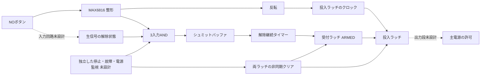

# 手動復帰回路の統合候補 revA

15部品・66端子の接続候補。回路の電気的適合、製造リリース、#24の完了を意味しない。個別候補のSHA256をassembly.jsonに記録し、全端子をconnections.csvへまとめた。独立停止と生信号処理の未設計部分を外部インターフェースとして明示する。

## 固定した接続

- U1 MAX6816EUS+T：出力は解除High。U2で反転したPRESSを投入ラッチへ接続する。
- U3 SN74HCS11PWR：RESET_N、保護・整形済み生解除信号、U1の解除出力をANDする。未使用ゲート入力はGND。
- U4 Nexperia 74LVC1G17GV：非反転でU5 MRを駆動。旧LVC1G34はこの版へ混在させない。
- U5 TPS3808G33DBVR：CTはR1=100k経由でVDDへ。RESET出力はR2=100kでプルアップし、受付ラッチのクロックへ。
- U6 SN74HCS74PW：受付段DはHigh、投入段DはARMED。両CLRは同じ独立RESET_N。PREはHigh。ENABLE_PERMISSIONは電源スイッチへ直結する信号ではない。
- 各ICに100nFの局所デカップリングを候補として追加。抵抗・コンデンサ・ボタンの実型番、公差、基板配置は未確定。

## 未設計インターフェースと確認項目

| 接続 | この版での扱い | 次に必要な判断 |
|---|---|---|
| BUTTON_RAW→RAW_RELEASED_CONDITIONED | 直結せず未設計と表示 | 入力保護、漏れ、しきい値、無給電時経路 |
| RESET_N | 外部入力として予約 | 電源投入・低下・停止・故障時の優先クリア回路と最小パルス幅 |
| ENABLE_PERMISSION | 論理出力のみ | 電源喪失時にも既定OFFとなる実スイッチ制御段 |
| LOGIC3V3 | 共通の上流電源 | 全負荷予算、電圧過渡、監視余裕 |

信号しきい値・同時エッジ・復帰条件のアナログ検証は未完了。接続表が生成できたことを動作確認と扱わない。検査はクリア配線、タイマー極性、投入クロック、生信号の未設計境界の保持に限定する。実機評価は#49へ分離するが、残る机上回路設計は#24に残す。

## 再生成

リポジトリルートから `python3 software/sim/circuits/package_manual_rearm_candidate.py --out <未作成ディレクトリ>`。個別JSONの変更後は再生成して接続差をレビューする。EDA回路図・PCB・製造BOMではない。
