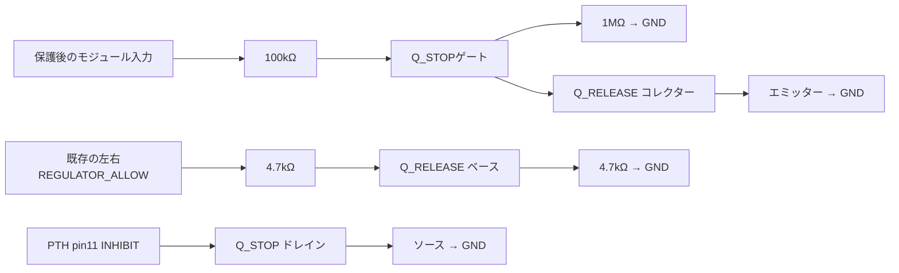

# PTH停止インターフェース候補

**接続を具体化した詳細検討案。製作リリース不可、全体v6への置換は未実施。** PTH240/241の比較に共通で使用する。BOMは左右12部品、抵抗の注文品番は未選定。既存Pololu用ENA抵抗へ追加する回路ではなく、置換時に使う別インターフェースである。

## 要求・仕様・設計判断

ユーザー要求は制御された給電・保護の成立。以下のトランジスター構成や抵抗値は設計側の案であり、指定部品ではない。

TIのINHIBIT pin11は開放で動作、Lowで停止し、外部プルアップは禁止。制御系が無給電でも停止側へ寄せるため、Q_STOPのゲートだけをモジュール入力へ抵抗で引き上げる。pin11には外部プルアップを接続しない。参照：[TI SLTS264J p4/p6](https://www.ti.com/lit/gpn/pth08t240w)。

Q_STOP候補は**onsemi BSS138**、Q_RELEASEはNexperia BC847B。全端子は[connections.csv](connections.csv)。ALLOWは既存のCTRL許可ラッチと個別起動要求のAND出力を使う。SYSの出力電圧監視リセットへ起動許可を従属させると起動循環になるため、従来の分離を維持する。サーボ給電の遮断・手動再ARMは下流保護回路が担当する。

## 抵抗値の判断と比較結果

[計算結果](review.json)は定常比較のみ。入力9〜12.6 V、抵抗総変動±1%、ゲート漏れ±5.1 µAは設計比較条件。最後の漏れ値はBC847BのICBOとMOSゲート漏れを参考にした感度入力であり、接続済み回路の漏れ上限を保証しない。

- ゲート電圧の16条件比較は7.699〜11.935 V。入力範囲内の定常ゲート駆動を確認するための値で、電源投入の競争や全温度保証には使わない。
- 235 µAはPTH停止端子電流の**典型値**。6 Ωとの比較では停止端子1.41 mVだが、最大電流を使った保証ではない。
- 解除側コレクター負荷は最大約127 µAの抵抗比較。ALLOW=2.4 V、VBE=0.9 Vという比較条件でベース電流約123 µA。BC847Bの10 mAでの飽和電圧仕様を、この低電流条件の保証へ読み替えない。
- 初案のベース100 kΩプルダウンは、ALLOW出力の無給電漏れ10 µAという割当で1 Vとなるため取りやめた。4.7 kΩでは47.47 mV。ベース直列も4.7 kΩへ変更してHigh時の電流を確保した。

Ioffは[SN74LVC1G08](https://www.ti.com/lit/ds/symlink/sn74lvc1g08.pdf)のVCC=0条件を参考とする。中間電源電圧の挙動を含まない。低電圧での接続回路漏れ・Q_RELEASEのOFF確認は残す。

## 部品の取り違えと未確認事項

[onsemi BSS138 Rev7](https://www.onsemi.com/download/data-sheet/pdf/bss138-d.pdf)の漏れ上限は30 V・25℃で100 nA、50 V・125℃で5 µA。TIの推奨「100 nA未満」を全温度で満たす証拠ではない。[Nexperia BSS138P](https://assets.nexperia.com/documents/data-sheet/BSS138P.pdf)は60 V・25℃で1 µAであり、同名相当品として自動置換しない。Q_RELEASEの飽和電圧によりQ_STOPのVGSは厳密な0 Vにならず、IDSS試験だけでも解除時の漏れを保証できない。

[BC847B](https://assets.nexperia.com/documents/data-sheet/BC847X_SER.pdf)のICBOはエミッター開放条件。ベース抵抗接続時の漏れ上限としては未確認。実使用温度・停止端子の内部特性・基板漏れを含めて適用性を判断する。

## 異常時の扱いと追加解析の終了条件

| 条件・故障 | 想定される影響 | 完了に必要な証拠 |
|---|---|---|
| CTRL電源なし／ALLOW開放 | ベース抵抗で解除側OFF、入力側抵抗で停止側ONを狙う | 漏れ・立上り・立下りを含め、サーボへの意図しない給電がないこと |
| Q_STOP D-S短絡 | 変換器を起動できない | 下流の再ARM禁止を維持し、異常表示へ到達 |
| Q_STOP開放／ゲート上側抵抗断線 | 変換器の停止保証を失う | 独立した下流遮断が残ること、故障電圧・エネルギー評価 |
| Q_RELEASE C-E短絡 | 変換器が許可なしで動作し得る | 同上。INHIBITのみを安全遮断としない |
| Q_RELEASE開放 | 変換器を起動できない | 起動監視で異常を保持し、サーボ再ARMを許可しない |
| 電池投入／急断／CTRLブラウンアウト | 一時的に停止解除される可能性は未評価 | 各電源順序でpin11・出力・下流EN波形を確認 |

追加解析は「停止指令から実際に給電が遮断されるまでの未確定経路」と「起動時の短時間解除」を解消するために行う。実部品の適用条件が確認できるまでは、理想スイッチの成功波形で代替しない。終了条件はpin11の有効Low、部品定格、下流遮断・残留エネルギー・再ARM条件を既存#24基準へ照合できること。停止電流最大・漏れの適用性が不足なら部品／回路変更を判断する。実装固有の漏れ・タイミング確認は#49へ引き継ぐが、この設計判断自体を実測へ丸投げしない。

再生成：リポジトリルートで `.venv-engineering/bin/python software/sim/circuits/design_pth_inhibit.py`。出力はBOM・端子接続・定常計算。SPICEや全電源の合格結果ではない。
