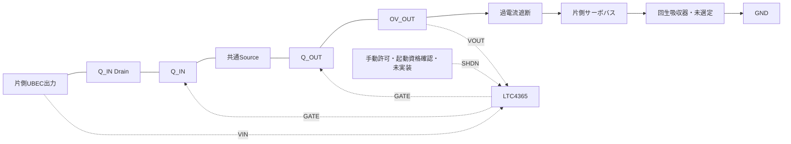

# 左右過電圧遮断の機能端子接続案 revA

製造用回路図・SPICEモデルではない。パッケージのピン番号へはまだ割り当てない。
`connectivity.json`に実部品候補6個の機能端子と接続先を保存した。
OV/UV分圧とSHDN受信回路などが未設計なので、このまま実装・通電しない。

左・右で同じ構成を独立させ、UBEC出力とサーボバスは左右で結ばない。
Q_INのDrainはUBEC、Q_OUTのDrainはOV_OUT、Sourceは両者だけの共通ノード。
この共通SourceをGNDへ接続しない。N-MOSFETのボディダイオードはSource→Drain。
両FETのOFF時にボディダイオードだけで入力から出力へ通る直列順方向経路はない。
これは理想OFF状態の接続上の性質であり、ゲート制御・漏れ・容量結合を含む遮断保証ではない。

LTC4365のVOUT端子は過電流遮断の**手前**OV_OUTへ接続する。
回生吸収器は両遮断段の**後ろ**SERVOに接続する。
OV_OUTへの移設では過電流遮断後の回生を吸収できなくなるため、別ノードとして保持する。

FAULTは状態出力として引き出すだけで、同じSHDN許可のRESETへ直結しない。
UV/OV分圧、電源立上り時の初期OFF、FAULT受信、部品定格と時間は未適合。
次の回路実装では未設計端子を埋めてからピン番号・配線と状態遷移を検証する。

## FETパッケージの番号照合

Vishay資料77684 Rev.B、2024-11-25の1ページ底面図を目視確認した。
SiSS80DN-T1-GE3は1/2/3=Source、4=Gate、5/6/7/8=Drain。
4個それぞれについて、全8ピンの機能名とネット名をconnectivity.jsonへ展開した。
確認したPDFのSHA256も同ファイルに保存した。

これはピン番号の対応であり、底面図をそのまま基板上面のフットプリントへ
転写する指示ではない。ランド寸法・上面から見た配置と回転は未確認。
コントローラの番号は今回のPDF取得が失敗したため未確定を維持した。
実装用の完全なネットリストとしては扱わない。
