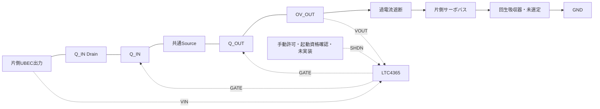

# 左右過電圧遮断の機能端子接続案 revA

製造用回路図・SPICEモデルではない。パッケージのピン番号へはまだ割り当てない。
`connectivity.json`に実部品候補6個の機能端子と接続先を保存した。
OV/UV分圧とSHDN受信回路などが未設計なので、このまま実装・通電しない。

左・右で同じ構成を独立させ、UBEC出力とサーボバスは左右で結ばない。
Q_INのDrainはUBEC、Q_OUTのDrainはOV_OUT、Sourceは両者だけの共通ノード。
この共通SourceをGNDへ接続しない。N-MOSFETのボディダイオードはSource→Drain。
両FETのOFF時にボディダイオードだけで入力から出力へ通る直列順方向経路はない。
これは理想OFF状態の接続上の性質であり、ゲート制御・漏れ・容量結合を含む遮断保証ではない。

LTC4365のVOUT端子は過電流遮断の**手前**OV_OUTへ接続する。
回生吸収器は両遮断段の**後ろ**SERVOに接続する。
OV_OUTへの移設では過電流遮断後の回生を吸収できなくなるため、別ノードとして保持する。

FAULTは状態出力として引き出すだけで、同じSHDN許可のRESETへ直結しない。
UV/OV分圧、電源立上り時の初期OFF、FAULT受信、部品定格と時間は未適合。
次の回路実装では未設計端子を埋めてからピン番号・配線と状態遷移を検証する。

## FETパッケージの番号照合

Vishay資料77684 Rev.B、2024-11-25の1ページ底面図を目視確認した。
SiSS80DN-T1-GE3は1/2/3=Source、4=Gate、5/6/7/8=Drain。
4個それぞれについて、全8ピンの機能名とネット名をconnectivity.jsonへ展開した。
確認したPDFのSHA256も同ファイルに保存した。

これはピン番号の対応であり、底面図をそのまま基板上面のフットプリントへ
転写する指示ではない。ランド寸法・上面から見た配置と回転は未確認。
コントローラの番号は今回のPDF取得が失敗したため未確定を維持した。
実装用の完全なネットリストとしては扱わない。

## コントローラTS8番号の候補登録

ADI直接配布の取得は再度失敗。TI技術フォーラムで配布されたメーカー旧資料4365fa
の2ページTS8上面図を目視確認し、1=VIN、2=UV、3=OV、4=GND、5=SHDN、
6=FAULT、7=VOUT、8=GATEを登録した。DDB/DFNの配列とは異なる。
資料URL・ハッシュと旧版であることをconnectivity.jsonに保存。
旧資料の定格を現Rev.Bへ上書きせず、現Rev.B図面との目視照合を残す。

これで候補6部品の48端子に番号とネットが入り、機能端子との対応・番号重複なしを
確認した。ただし未設計の分圧・許可回路・ゲート回路は埋まっていない。
実装・過渡検証の合格ではなく、製造用の完全回路でもない。

左右SHDNへ100kΩの局所プルダウン各1個を追加（TNPW0603100KBYEA）。
候補は8部品・52端子となった。受信回路はまだ未設計。
`validation/servo_shdn_bias_v1/`は漏れ予算の静的比較であり、初期OFFの保証ではない。

専用SHDN受信バッファ74LVC1G17GVを左右各1個、局所100nFを各1個追加。
POWER_ENABLE_COMMANDを受ける構成候補で、合計12部品。起動資格確認をバッファに
代行させるものではない。静的漏れ比較は`validation/servo_shdn_bias_v1/`参照。
