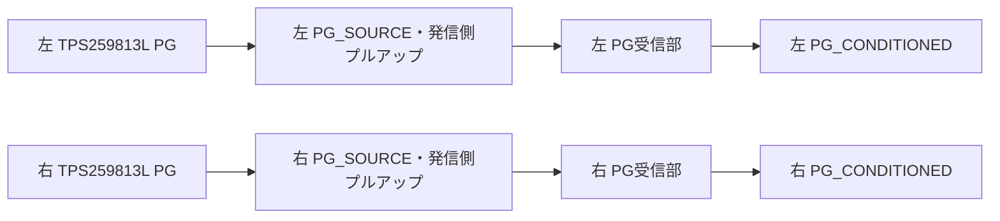

# 左右電源段と手動再始動回路の接続統合候補

`manual_rearm_revJ`の54部品へ、TPS259813Lを使う`integrated_servo_power_revA`の14部品を統合。68部品・238端子。参照名重複はなく、両断片が共有するネットはGNDと左右PG_SOURCEだけであることを確認した。

左右ともeFuseのPG（3番端子）→発信側プルアップ→明示されたPCB配線→PG受信分圧抵抗の接続を確認した。左右のPGを一つへ短絡していない。PG受信回路を重複追加していない。

## 接続済みの範囲



PG配線の局所DC比較は `validation/dual_pg_25981_dc_v1` にある。今回の接続一致を、電源遷移・短パルス捕捉・故障時の停止の証明に使わない。

## 設計を要する接続

既存MAIN_EFUSE_ENを左右EN_UVLOへ直結していない。TPS259813LのEN/UVLOの閾値、ドライブ、分圧、停止時とロジック電源喪失時の既定状態を設計してから接続する。未接続をGNDや許可信号で便宜的に埋めない。

左右FLT、ITIMER、起動状態回路、電源電圧監視、変換器、入出力容量、回生吸収、出力放電、電池保護は未統合。ゲート部品等10個の型番がnullで、既存ロジック側もBOM照合資料を別に必要とする。OVLOの異常時入力範囲とFETの駆動条件も未適合。

これは完成回路、製造BOM、ERC合格、保護合格ではない。分離した候補間のPG接続を具体化した中間設計で、従来LTC4365案と併用しない。

再現（リポジトリ直下、新規出力先）:

```sh
.venv-engineering/bin/python software/sim/circuits/integrate_servo_power_and_rearm.py --out /tmp/servo-power-rearm
```

追加制約: `validation/enable_supply_fault_domain_v1`。旧U10のEFUSE_INPUT_5Vを無保護で変換器出力へ割り当てると、3S入力貫通故障で絶対最大定格を超える。EN接続前に停止回路の電源ドメインを設計する。
