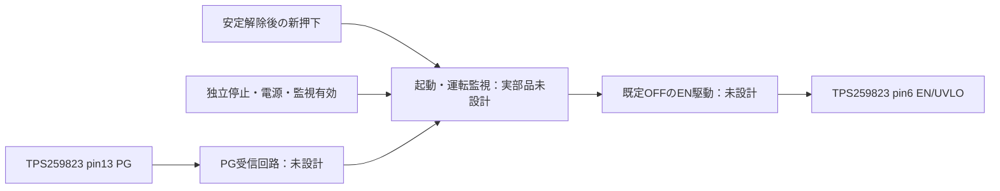

# 主eFuseのPGと停止接続

## 結論

TPS259823ONRGEの13番はPG（給電成立）で、独立したFAULT端子はない。PGを再許可ラッチのRESET_Nへ直結する案は不採用。停止中PG Low→CLR Low→投入不可→PG Lowという起動不能の循環になる。電源監視／独立停止と、投入後の成立監視を区別する必要がある。

根拠：[TI TPS25982](https://www.ti.com/lit/ds/symlink/tps25982.pdf)、SLVSEI3D May 2026、端子表、電気特性、7.3.6。ダウンロードしたPDFのSHA256はplan.json。9ページの表を画像で確認した。

## 電気条件

PG無給電側Low最大0.786 Vは26 µA規定点。3.393 Vと99 kΩの仮置きでは、その電圧でプルアップだけでも26.333 µAとなり規定点を超える。通電時入力電流3 µAを比較加算すると29.333 µA。これは実Low値の予測ではなく、既存負荷で規定を流用できないことを示す。抵抗を変更して直結を救済しても起動不能は解消しないため、ここで直結案の追加解析を終了する。

PG High漏れ最大1.7 µAを既存RESET_Nの比較へ加えるとHigh下限2.702 V。これも受信しきい値と未給電条件を含む保証ではない。通電／無給電で同じ漏れモデルを使わない。

## 接続方針



独立停止は全状態で優先する。新押下でSTARTへ移り、PG成立でRUNへ移る。STARTの期限切れとRUN中のPG喪失でFAULTへ移り、新たな適格押下まで復帰しない。期限とPGが同時なら期限切れを優先する。START中の独立停止はマスクしない。fresh_requestは生ボタンではなく、既存の解除確認・新押下経路が生成すべき事象。

64通りの抽象遷移と直接接続の反例を保存した。時間単位は導入していない。実際の起動期限は電源段の立上りと許容エネルギーから決めるため未設定。PG固着High、絶対過電圧、外部停止断線の検出をこの状態機械で保証していない。現revBへ追加配線して完成とは扱わず、#24は未完了。

## 再現

```sh
curl -L https://www.ti.com/lit/ds/symlink/tps25982.pdf -o /tmp/tps25982.pdf
python3 software/sim/circuits/check_main_efuse_pg_interface.py --datasheet /tmp/tps25982.pdf --out /tmp/main_efuse_pg_review
```

出力先は未作成ディレクトリを指定。PDFが更新されてSHAが異なる場合は元の仕様との一致を再確認する。机上の接続論理の検証であり、回路シミュレーションや実測の代替ではない。
