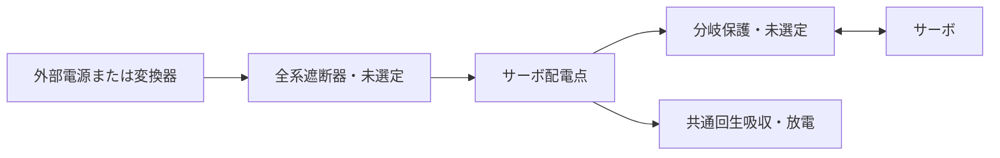

# 遮断状態と回生経路の構成審査

2026-09-21。目的と終了条件はplan.jsonを先に保存。未知のモーター特性を設定した回路シミュレーションではなく、提案回路の接続関係だけを確認した。

## 判断

**共通吸収回路は電源遮断器よりサーボ側へ配置する。** これにより電源を切っても、健全な分岐から吸収回路へ至る接続は残る。ただし吸収回路の制御電源も必要で、接続だけでは動作を保証しない。

**分岐ヒューズ/遮断器の開放時には、共通吸収回路だけではその軸を保護できない。** 電子ヒューズだけでなく普通のヒューズでも同じ問題が生じる。片側断線・抜線も同様。内蔵保護があるという未確認の仮定で穴を埋めない。

図は構成条件であり製作回路図ではない。DATA/GNDによる別経路、遮断素子の寄生ダイオード、電源の逆吸収は含まない。

## 保存した5状態

| 状態 | 接続判定 | 設計への反映 |
|---|---|---|
| 通常 | 全軸から共通吸収器へ到達 | 吸収電圧/電力/応答は別途必要 |
| 電源遮断 | 同上 | 吸収器を遮断器の負荷側へ置く。補助電源喪失の設計も必要 |
| 分岐0開放 | 軸0だけ到達不可 | 分岐より下流の吸収、または遮断時にも残る別の回生経路が必要 |
| 軸0のケーブル抜け | 軸0だけ到達不可 | サーボ側に残る保護か、メーカーの無給電被駆動時仕様の確認が必要 |
| 電源遮断＋分岐0開放 | 軸0だけ到達不可 | 全系停止だけでは分岐故障を解消しない |

12分岐を同一接続としたため代表軸0で切断を確認。実配置の非対称性・多重故障・全故障網羅を証明したものではない。到達不可は回生電圧の具体的予測ではなく、保護成立の根拠が欠けることを示す。

## 次の設計作業を限定する条件

1. 分岐開放後にもサーボ側に残る吸収経路の実部品案を1案作る。端子6.0 V以内、通常4.75〜5.25 V、電圧降下予算との整合を公差込みで机上審査する。
2. ケーブル抜けは、保持具で発生確率を下げる対策と、発生後の電気的保護を区別する。抜線を単に解析対象外へ移して合格にしない。内蔵保護の一次資料が得られなければ未確認として#24/#49に残す。
3. 実部品の公差だけで構成が成立しなければ部品/経路を再設計し、仮想回生の波形を増やす段階には進まない。

復帰は手動再許可を要求する設計方針を保持。ラッチ付き部品の品名だけで、電源喪失後も停止記憶が保持されると仮定しない。

再現：`.venv-engineering/bin/python software/sim/circuits/audit_power_paths.py`。結果はreport.json。全状態の経路条件は不合格、実電気保護は未検証。
