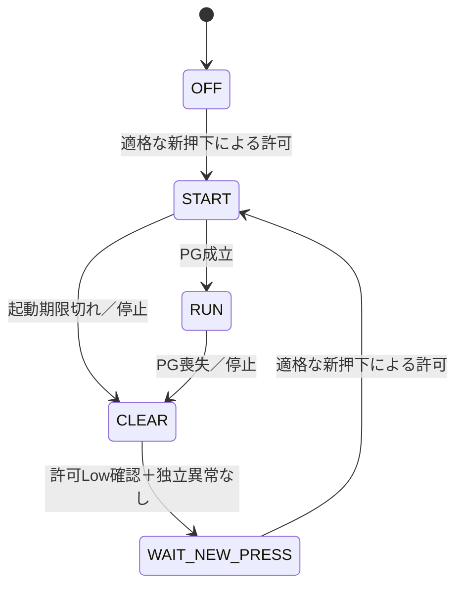

# 起動監視と許可解除のハンドシェイク

## 設計判断

PG故障を保持する状態を、そのままRESET_Nの連続Lowへ接続しない。故障保持中はラッチがクリアされ続け、新たな適格ボタン操作でも投入許可を作れず復帰不能となる。

代わりに起動監視をOFF／START／RUN／CLEAR／WAIT_NEW_PRESSへ分ける。故障時はSEQUENCE_ENABLE_REQUESTを先に取り消し、CLEARでラッチ許可を解除する。ENABLE_PERMISSION Lowを確認してクリア要求だけを解除し、WAIT_NEW_PRESSで故障後の待機を保持する。新たな適格押下が許可をセットした場合にだけSTARTへ移る。PGの復帰だけでは起動しない。独立した停止・電源異常は全状態で優先する。

## revFとの境界

SEQUENCE_ENABLE_REQUESTは既存U3第2ゲートへ接続する。追加するSEQUENCE_CLEAR_REQUESTはRESET_NをLowにする実シンク回路を要する。ENABLE_PERMISSIONを監視して解除完了を確認する。故障記憶とクリア要求は別信号であり、PGやENをRESET_Nへ直結しない。

クリア要求を解除しても、許可がLowなのでrevFのゲートはEN指令をLowに保つ。実機回路ではクリアの最低パルス幅、ラッチ出力の伝搬、確認回路の応答、同時押下を評価しなければならない。今回の1ステップは経過時間を表さず、ゼロ時間のパルスを許可する意味ではない。

## 確認結果と限界

160通りの抽象状態・入力組合せ、およびPG成立→喪失→復帰→新操作→起動期限切れの時系列を確認した。独立異常、PG喪失、期限切れで指令を停止し、PG復帰やボタン保持だけでは再投入しない。新操作では再び起動できる。

電圧・遅延・短パルス・電源喪失を含む回路検証ではない。新操作は既存の安定解除後の押下条件が生成する事象として扱う。実PG受信、タイマー値とエネルギー根拠、状態保持・クリアシンク・確認回路は未設計。論理表を実装完了の証拠とはしない。#24は未完了、通電保留。

追加論理探索はここで終了し、この入出力を実部品へ割り当てる。PGの未知の立上り時間を仮定した追加掃引は行わない。

再現：`python3 software/sim/circuits/check_sequence_clear_handshake.py --out /tmp/sequence_clear_handshake`。未作成出力先を指定。
